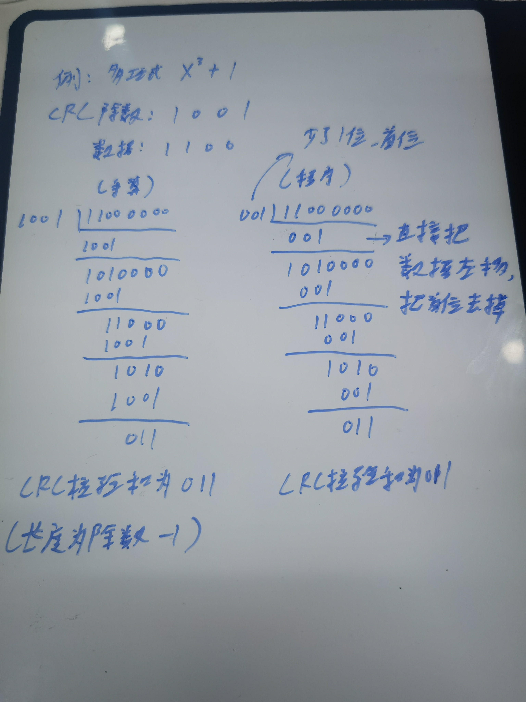

# STM32 串口通信与 CRC16 校验协议

本项目是一个基于 STM32F103 的串口通信示例，解决了不同平台通信的问题，旨在演示如何实现一个包含 CRC16 校验的自定义通信协议。本文以`CRC16串口收发（使用回调函数）`编写，将底层串口驱动与上层通信协议分离，结构清晰，便于学习和扩展。

## 关于CRC校验

[[CRC校验]手算与直观演示视频链接]( https://www.bilibili.com/video/BV1V4411Z7VA/?share_source=copy_web&vd_source=c6a42500d0a4253d9773a68bab73298b)

> 

### CRC16/MODBUS 校验码计算程序实现

```c
/**
  * 函    数：计算CRC16/MODBUS校验码
  * 参    数：data 要校验的数据首地址
  * 参    数：len 要校验的数据长度
  * 返 回 值：返回CRC16校验值
  * 注意事项：多项式：x^16 + x^15 + x^2 + 1 (即 0x8005)
  * 		 初始值为：0xFFFF
  * 		 
  */
static uint16_t Serial_Protocol_CRC16Check(const uint8_t *data,uint8_t len)
{
	uint16_t CRC16 = 0xFFFF;	 // 初始化CRC

	for (uint8_t i = 0; i < len; i ++)	// 遍历每一个输入数据字节
	{
		// 将当前数据字节与CRC寄存器的高8位进行异或
        // 这一步相当于把新的8位数据“喂”给CRC计算引擎，整合之前所有数据的CRC值
		CRC16 ^= (data[i] << 8);

		// 由于数据data的位数为8位，需要计算8次
		for (uint8_t bit = 0; bit < 8; bit ++)
		{
			if (CRC16 & 0x8000) // 检查数据最高位是否为1
			{
				CRC16 <<= 1;	// 如果最高位是1，CRC寄存器先左移一位 (丢弃最高位)
								// 由于多项式生成的除数为1 1000 0000 0000 0101为17位
								// 而程序除数1000 0000 0000 0101只有16位，相比于理论除数少了一位
								// 所以得从被除数补回来，抵消这个少了一位除数的影响

				CRC16 ^= 0x8005;// 然后进行异或操作，算出CRC值
			} 
			else 
			{
				CRC16 <<= 1;	// 没有找到首位为1，继续移动寻找
			}
		}
	}

	return CRC16;
}
```

## 项目结构

代码主要分为两个层次：

1.  **硬件驱动层 (`Serial.c`/`.h`)**:
    -   负责 UART1 的初始化和数据收发。
    -   提供字节、数组、字符串等多种数据发送接口。
    -   通过回调函数机制，将接收到的数据传递给上层处理，实现底层与协议层的解耦。

2.  **通信协议层 (`Serial_Protocol.c`/`.h`)**:
    -   构建于硬件驱动层之上，实现具体的通信协议。
    -   定义了包含帧头、长度、命令、数据、CRC16 校验和帧尾的数据帧格式。
    -   包含一个状态机用于解析接收到的数据流。
    -   实现了 CRC16/MODBUS 校验算法以确保数据完整性。

## 功能特性

- **分层设计**: 硬件驱动与通信协议分离，易于维护和移植。
- **回调机制**: 底层串口接收数据后，通过回调函数通知上层协议层进行处理，响应及时。
- **CRC16 校验**: 使用 CRC16/MODBUS 算法对数据帧进行校验，保证通信的可靠性。
- **状态机解析**: 使用状态机精确解析数据帧，鲁棒性强。
- **结构化数据传输**: 支持将 C 语言结构体 (`struct`) 格式化为字符串后打包发送。

## 如何使用

1.  **初始化**:
    *   在主函数 `main()` 中，首先需要调用 `Serial_Init()` 来完成串口硬件 (USART1) 的初始化。
    *   接着调用 `Serial_Protocol_Init()`，**此函数会将协议层的接收回调函数注册到底层驱动**，完成协议栈的初始化。

    ```c
    #include "Serial.h"
    #include "Serial_Protocol.h"
    
    int main(void)
    {
        // ... 其他初始化 ...
    
        Serial_Init();          // 初始化串口硬件
        Serial_Protocol_Init(); // 初始化通信协议并注册回调
    
        // ... 主循环 ...
    }
    ```

2.  **发送数据**:
    *   定义一个 `DataStruct` 类型的变量并填充数据。
    *   调用 `Serial_Protocol_SendStructData()` 函数，将结构体数据打包成协议帧并通过串口发送。

    ```c
    DataStruct myData;
    myData.keyNum = 1;
    myData.floatData = 12.34f;
    myData.intData = 567;
    
    // 以命令字 0x01 发送数据
    Serial_Protocol_SendStructData(0x01, &myData);
    ```

3.  **接收数据**:
    *   数据接收是全自动的。当串口接收到数据时，`USART1_IRQHandler` 中断服务程序会被触发。
    *   中断程序调用已注册的回调函数 `Serial_Protocol_Receive()`，该函数内部的状态机将自动处理字节流，完成组帧、CRC 校验和数据解析。
    *   在主循环中，可以通过调用 `Serial_Protocol_GetReceivedStructData()` 来获取最新解析出的数据。

    ```c
    // 在主循环中
    DataStruct receivedData = Serial_Protocol_GetReceivedStructData();
    // 现在可以使用 receivedData 中的数据了
    ```

## 数据帧格式

本协议定义的数据帧格式如下：

| 帧头 (2B) | 长度 (1B) | 命令 (1B) | 数据 (N B) | CRC16 (2B) | 帧尾 (1B) |
| :-------: | :-------: | :-------: | :--------: | :--------: | :-------: |
| `A5 5A`   | `N`       | `Cmd`     | `Data...`  | `CRC Hi Lo`| `FF`      |

- **帧头**: 固定为 `0xA5 0x5A`。
- **长度**: `N`，表示 "数据" 部分的字节长度。
- **命令**: `Cmd`，用于区分不同的数据类型或操作。
- **数据**: 实际承载的数据负载。
- **CRC16**: 对 `帧头` 到 `数据` 部分（共 4+N 字节）计算出的16位校验码。
- **帧尾**: 固定为 `0xFF`。

---
*作者: Amuvin*
*日期: 2025年12月15日*